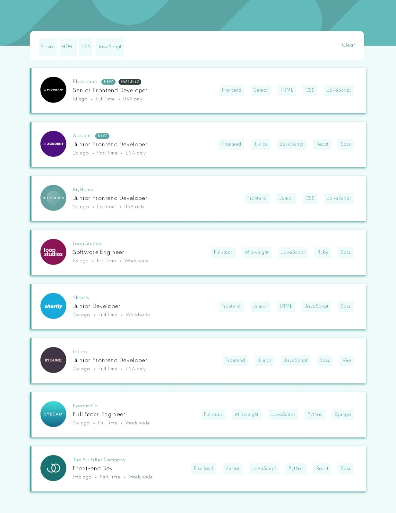

[](https://app.netlify.com/sites/static-job-listings-with-filter/deploys)

# Frontend Mentor - Job listings with filtering solution

This is a solution to the [Job listings with filtering challenge on Frontend Mentor](https://www.frontendmentor.io/challenges/job-listings-with-filtering-ivstIPCt). Frontend Mentor challenges help you improve your coding skills by building realistic projects. 

## Table of contents

- [Overview](#overview)
  - [The challenge](#the-challenge)
  - [Screenshot](#screenshot)
  - [Links](#links)
- [My process](#my-process)
  - [Built with](#built-with)
  - [What I learned](#what-i-learned)
  - [Continued development](#continued-development)
  - [Useful resources](#useful-resources)
- [Author](#author)


## Overview

### The challenge

Users should be able to:

- View the optimal layout for the site depending on their device's screen size
- See hover states for all interactive elements on the page
- Filter job listings based on the categories

### Screenshot




### Links

- Solution URL: [click here](https://github.com/macluiggy/static-job-listings-master)
- Live Site URL: [click here](https://static-job-listings-with-filter.netlify.app/)

## My process

### Built with

- Semantic HTML5 markup
- CSS custom properties
- Flexbox
- CSS Grid
- Mobile-first workflow
- [React](https://reactjs.org/) - JS library
- [Sass](https://sass-lang.com/) - CSS preprocessor


### What I learned

My first project using react, in this project I learned to filter content in a webpage, to do so the concepts of components were apply, I divided the header and the main sections in two components, this way tha App component group together all the content.
Sass was also used, importing all the css neccesary in the App component.

The concept of the state object was used to help filter the content of the webpage, the array that contains its id were modified depending if the skill the user select is in each section of skills:
```js
state = {
        skills: [],
        cardContainer: "items item1",
        none: "none",
        sections: ["one", 'two', "three", 'four', 'five', "six", 'seven', 'eight', 'nine', 'ten'],
        sectionsFixed: ['one', "two", 'three', 'four', 'five', "six", 'seven', 'eight', 'nine', 'ten']
    }
```
So whe a user click in a skill it triggers a method to filter the content, this is the code i used:
```js
filterSkill = (e) => {
        //console.log(e.currentTarget)
        let skill = e.target.innerText;//el valor que se obtiene cuando se cliquea en una de las skills
        //console.log(this.props.data)
        //console.log(skill);
        this.setState({
        	skills: [...this.state.skills, skill]//actualiza las skills del state object añadiendo la que se acaba de clicar
        })
   		
        //llama otra funcion
        this.filterContainer(skill);//llama a la funcion que filtrara la skill

    	this.showSkillsContainer();//muestra el contenedor de las skills filtradas
    }
```
When the array of clicked skills is filtered, it triggers another functions to filter each section depending if the skill is or not in that section:

```js
filterContainer = (skill) => {
    	let array = this.props.data;//el array que proviene de App
    	let arr2 = [...new Set([...this.state.skills, skill])];//evita que se repita los mismos valores en el array
    	
    	//itera por cada elemento del array
    	for(let i = 0, length1 = array.length; i < length1; i++){
    		let person = array[i];//cada elemneto del array representa un objeto con datos de un individuo
    		//el añade un array con los datos correspondientes 
    		const arrSinLimites = [person.role, person.level, ...person.languages, ...person.tools];
    		const arr1 = [...new Set(arrSinLimites)];// evita que ese array se repita
    		let test = arr1.some(i => arr2.includes(i));//verifica si al menos un elemento del arr2 se encuentra en el arr1
    		//p(arr2)
    		//p(arr1)
    		//p(test)
    		if (test) {// si el test es verdadero
    			// statement
    			this.state.sections[i] = this.state.sectionsFixed[i];//cambia el id de la seccion correspondiente al id que lo mostrara por pantalla
    		} else {
    			// statement
    			this.state.sections[i] = this.state.none; //si no, cambia el id para que no se muestre por pantalla
    		}
    	}
    	
    }
```
The above script filter each section, iterate an make an array to filter the filtered skills array with the current skills array, if at leas one arr1's item is in the arr2, the test pass and filter the current section.
```react
<div className='filter_container'>
				<ul className="skills2">
                	{[...new Set(this.state.skills)].map(skill => {//mapea cada elemento del array de las skills filtradas, y añade cada una al contenedor
                		count++;//aumenta el contenedor
                		return <li key={count}>
                		<p>{skill}</p>
                		</li>;
                	})}
            	</ul>
            	<span className="clear" onClick={this.clear}>Clear</span>
			</div>
```
When the content is filtered,  the filtered skills array is mapped to display in the screen each skill.


### Continued development

React is a very useful framework, so I will continue learning this tool.

### Useful resources


### Useful resources
[w3school](https://www.w3schools.com/) and [stackoverflow](https://stackoverflow.com/) were of great help to solve some doubts.

## Author

- Frontend Mentor - [@macluiggy](https://www.frontendmentor.io/profile/macluiggy)
- LinkedIn - [Luiggy Macias](https://www.linkedin.com/in/luiggy-macias-402696155/)
